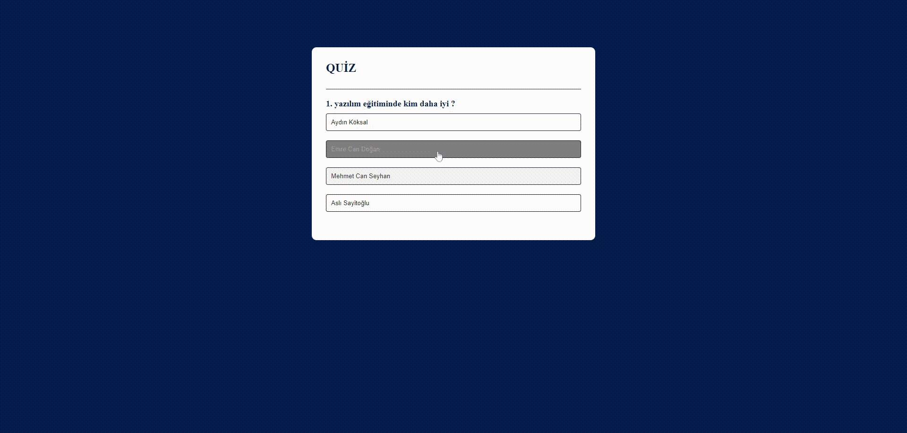

# quiz_js

It is a quiz project that checks the correctness of the answers given to the questions asked and determines the score according to the correct answers. It is designed with html - css - javascript.

